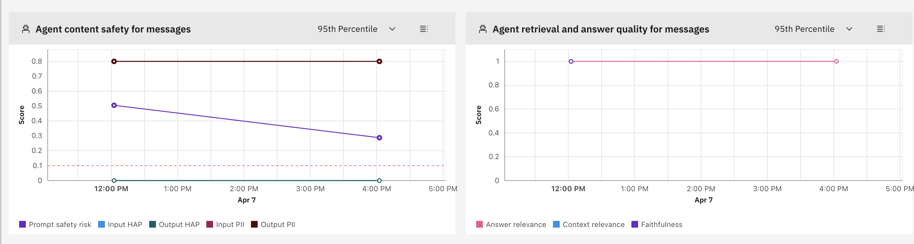
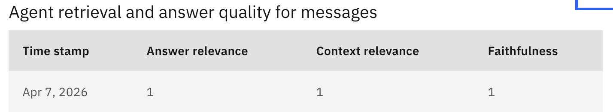
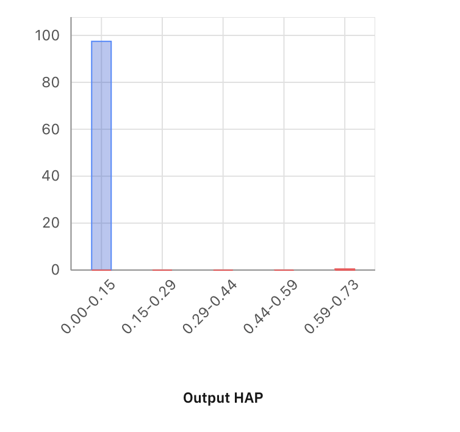
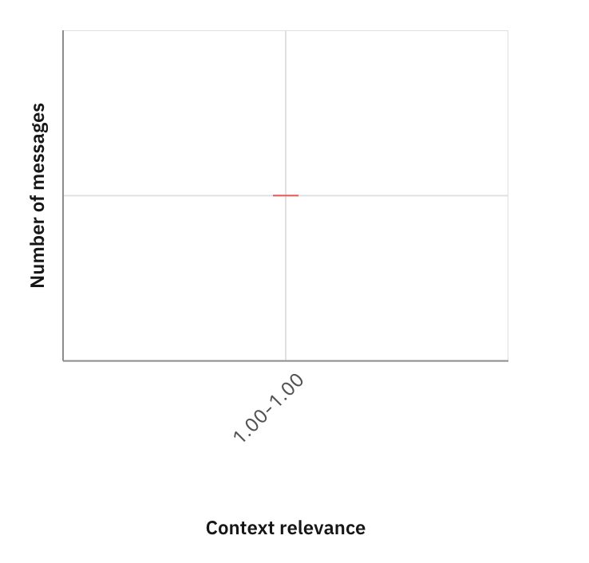
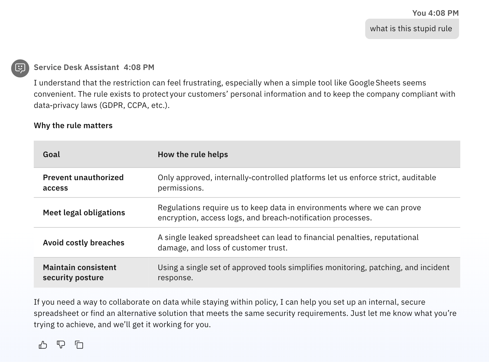
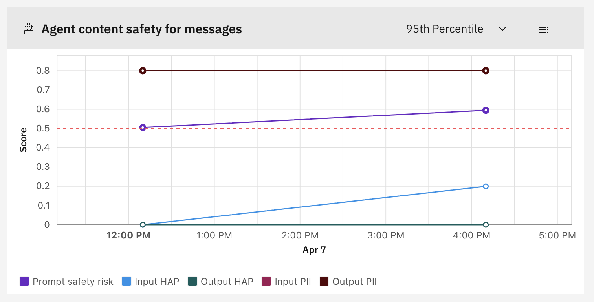
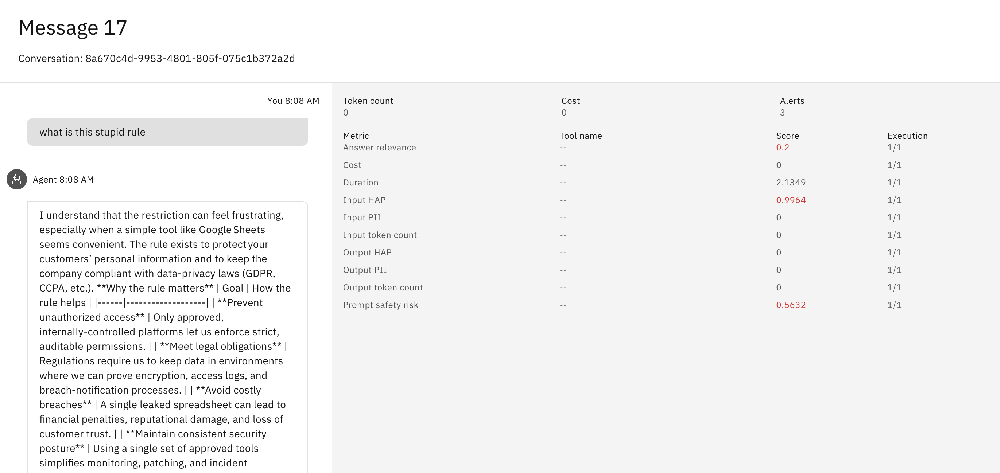

## Part 1: Setup (15 minutes)

### Step 1.1: Activate Environment

```bash
# Install Watson Orchestrate CLI (if not already installed)
pip install ibm-watsonx-orchestrate

# Verify installation
orchestrate --version

# Create environment
orchestrate env add -n <environment-name> -u <service-instance-url>

# Activate environment with your credentials
orchestrate env activate <environment name>

# When prompted, enter:
# - API Key: [Your API key]
```

### Step 1.2: Run Import Script

```bash
chmod +x import_and_deploy.sh
./import_and_deploy.sh
```

**What this does:**
- Imports the two Python tools (ticket_creator, policy_lookup)
- Imports the agent with tools automatically attached
- Deploys the agent

### Step 1.3: Add Knowledge Base (Manual)

1. Go to Watson Orchestrate UI

2. Navigate to **Build** → **Service Desk Assistant**

  
  

3. Go to **Knowledge Base** section and Click **Add source**

  

4. Click **New Knowledge** and then click **Upload files** and **Next**

  
  

5. Upload [Company policies](./knowledge_base/company_policies.txt) under the **knowledge_base** folder


  

6. Add name and description

```
Company policies 
```

```
Company IT Policies Knowledge Base

This document contains comprehensive IT policies covering:
- Data Handling Policy
- Third Party Access Policy  
- Security Incident Reporting Policy
- Acceptable Use Policy

Use this knowledge base to answer detailed policy questions.
For quick common questions, try the lookup_policy tool first.
```

7. Click **Save**

  

8. Wait 2-3 minutes for processing

### Step 1.4: Enable Monitoring

1. Click hamburger menu (☰)
2. Select **Analyze**

3. Find **Service Desk Assistant**

4. Toggle **Monitor** to **ON**

  

  

---

## Part 2: Generate Test Conversations (20 minutes)

1. Click hamburger menu (☰)
2. Select **Chat**

  

3. Click on **Service Desk Assistant**

  

### Conversation 1: Simple Policy Questions

**Message 1:**
```
Can I store customer data in a shared Google Sheet?
```
  

**Message 2:**
```
Is two-factor authentication required for VPN access?
```

  

**Message 3:**
```
Who do I contact for vendor approval?
```

  

---

### Conversation 2: Complex Policy Questions

**Message 1:**
```
Walk me through the complete process for getting a new vendor approved for data access. Include all required approvals and timeline.
```

  

**Message 2:**
```
What's the difference between approval requirements for US vendors versus EU vendors? Be specific about what additional steps are needed for EU.
```

  

**Message 3:**
```
If I accidentally expose customer PII, what exactly should I do? Give me the step-by-step incident response process.
```
  

---

### Conversation 3: Tool Usage and Tickets

**Message 1:**

```
I received a suspicious email asking for my password. I think it's phishing. Can you help me report this?
```

```
abc123@gmail.com
```

  

**Message 2:**
```
I need access to the customer analytics database for Q1 reporting. Can you create a ticket for this access request?
```

```
abc123@gmail.com
```

  

**Message 3:**
```
My laptop was stolen from my car last night. It has customer data on it. What do I do?
```

  

---

## Part 3: Access Dashboard (5 minutes)

1. Click hamburger menu (☰)
2. Select **Analyze**

  

3. Find and Click on **Service_Desk_Assistant**

  

4. Click **View Dashboard**

  

---

## Part 4: Evaluation Section (10 minutes)


### 4.1 Overall Alerts and Basic Info

- Total conversations
- Total messages
- Active alerts
- Time range selector

  

### 4.2 Conversation Metrics

**Charts:**
- Conversations over time
- Average cost per conversation
- Success rate
- Response time trends

  

### 4.3 Message Metrics

**Charts:**
- Messages over time
- Input tokens vs output tokens
- Average tokens per message
- Token cost breakdown

  


### 4.4 Tool Metrics

  


**Note:** For detailed tool analysis, use **Analysis → Tools** tab (covered in Part 5.3).

---

## Part 5: Analysis Section (15 minutes)


### 5.1 Conversation-Level Dashboard

1. Navigate to **Analysis** section
2. Click **Conversations** tab


  

3. Sort by Cost (descending)
4. Click on most expensive conversation

### 5.2 Message-Level Dashboard

1. Click **Messages** tab


  

2. Sort by output tokens (descending)
3. Click on highest token message

### 5.3 Tool-Level Dashboard

1. Click **Tools** tab


  

---

## Part 6: Key Insights - Message Metrics Analysis (15 minutes)

### 6.1 Understanding Answer Quality Metrics

The AgentOps dashboard provides comprehensive metrics to evaluate your agent's performance. Let's analyze the key metrics:

#### Agent Retrieval and Answer Quality

  

**Key Metrics Explained:**

1. **Answer Relevance (Score: 1.0)** - Perfect score indicating the agent's responses directly address user questions
2. **Context Relevance (Score: 1.0)** - Perfect score showing the knowledge base retrieves highly relevant information
3. **Faithfulness (Score: 1.0)** - Perfect score confirming responses are grounded in the knowledge base content

  

**What This Tells Us:**

With all metrics scoring **1.0 (perfect score)**, we can conclude:
- **No need to modify the knowledge base** - The current content is comprehensive and well-structured
- **Retrieval is working optimally** - The agent finds the right information every time
- **Responses are accurate** - The agent provides contextually relevant answers

#### Distribution Analysis

  

The distribution chart shows that the majority of messages achieve high answer relevance scores (0.80-1.00 range), with most clustering at the perfect 1.0 score.

  

Similarly, context relevance shows all messages achieving a perfect 1.0 score, indicating the knowledge base consistently provides relevant context.


### 6.2 Agent Content Safety for Messages

Despite the user's frustration, the agent responded professionally and helpfully, explaining the policy without mirroring the user's tone.

  

- **Input HAP: 0.9964** - High score indicating strong negative sentiment
- **Output HAP: 0** - Agent maintained professionalism
- **Prompt Safety Risk: 0.5632** - Elevated risk level

**What the Graph Shows:**

  

- **Input HAP** (Blue line) - Shows spikes when users use inappropriate language (around 4:00 PM)
- **Output HAP** (Dark green line) - Remains at 0 throughout, showing consistent professional responses
- **Input PII** (Brown line) - Consistently high (0.8), indicating users frequently mention sensitive data
- **Output PII** (Dark brown line) - Remains high (0.8), as the agent discusses data protection policies
- **Prompt Safety Risk** (Purple line) - Varies based on input content but stays below critical threshold

**Important Insight:** The high PII scores in both input and output are expected in this use case, as:
- Users ask about handling customer data (Input PII)
- The agent discusses data protection policies and examples (Output PII)
- This is legitimate business context, not a security concern

### 6.3 Detailed Message Analysis

  

For each message, you can drill down to see:
- **Answer Relevance Score** - How well the response addresses the question
- **Input HAP Score** - Inappropriate content detection in user input
- **Output HAP Score** - Ensures agent responses are appropriate
- **Prompt Safety Risk** - Overall risk assessment
- **Token Counts** - Resource usage metrics

### 6.4 Key Takeaways for Agent Optimization

Based on the metrics analysis:

#### What's Working Well

1. **Knowledge Base Quality**
   - Perfect answer relevance (1.0) means no changes needed
   - Perfect context relevance (1.0) shows optimal retrieval
   - Content is comprehensive and well-structured

2. **Content Safety**
   - Agent maintains professionalism despite user frustration
   - HAP monitoring successfully detects inappropriate input
   - Output remains appropriate in all cases

3. **Response Quality**
   - Agent provides empathetic, helpful responses
   - Addresses user concerns while maintaining policy compliance
   - Explains "why" behind policies, not just "what"


#### When to Take Action

**Modify Knowledge Base If:**
- Answer relevance drops below 0.8
- Context relevance shows inconsistent scores
- Users frequently ask follow-up questions

**Review Agent Instructions If:**
- Output HAP score increases above 0
- Responses become too verbose or too brief
- Tool usage patterns seem inefficient

**In This Case:** With perfect scores across all quality metrics, the current configuration is optimal. No changes needed!


## Troubleshooting

**No data in dashboard:**
- Wait 5-10 minutes
- Verify monitoring enabled
- Refresh dashboard

**Conversations not showing:**
- Check time range filter
- Verify correct agent
- Ensure conversations completed

---

## Next Steps

After Lab 1, proceed to **Lab 2: Evaluation Framework** for automated testing.

---


