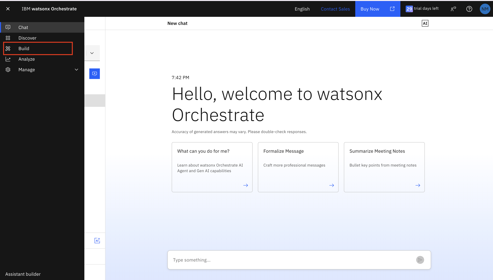
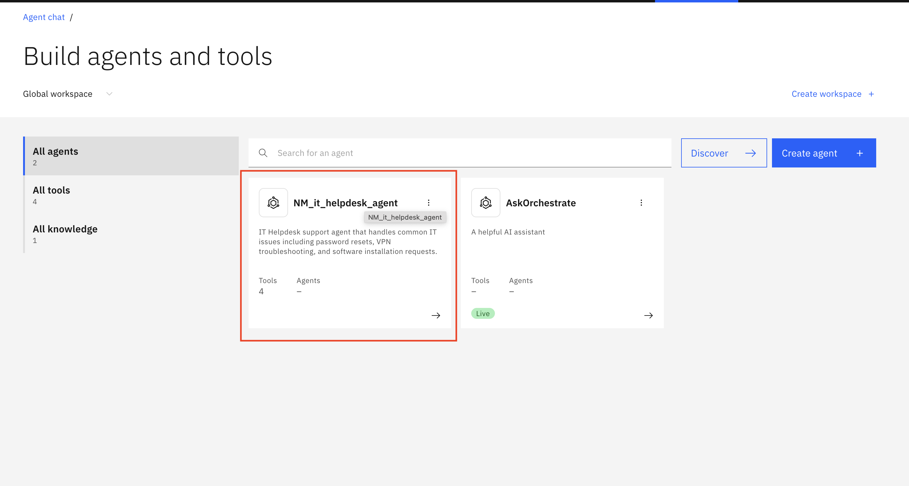

# Lab 2: Evaluation Framework - Automated Testing

## Lab Overview

**Duration:** 30 minutes
**Prerequisites:** Completed Lab 1, CLI installed, Python 3.8+

**Target Audience:** Developers, data scientists, and QA engineers who need programmatic access to detailed metrics, want to automate testing, and require deeper insights than the UI dashboard provides.

---

## Setup

### Step 1.1: Activate Environment

```bash
# If not already activated from Lab 1
orchestrate env activate <environment name>

# When prompted, enter:
# - API Key: [Your API key]
```

### Step 1.2: Create Directory Structure

```bash
mkdir -p evaluation/output evaluation/results
```

### Step 1.3: Verify Agent Name

```bash
orchestrate agents list
```
---

## Evaluation Framework

### How Evaluation Works

The evaluation framework uses a **surrogate user** (an LLM-powered agent) that simulates real user interactions:

```
                    ┌─────────────┐
                    │ User Story  │  (what the user wants to do)
                    └──────┬──────┘
                           │
                    ┌──────▼──────┐
                    │  Surrogate  │  (LLM simulates the user)
                    │    User     │
                    └──────┬──────┘
                           │ sends messages
                    ┌──────▼──────┐
                    │   Target    │  (your agent being tested)
                    │   Agent     │
                    └──────┬──────┘
                           │ responses
                    ┌──────▼──────┐
                    │  Compare    │  (actual vs expected)
                    │  Results    │
                    └─────────────┘
```

1. The surrogate user follows the **user story** to send messages to your agent
2. Your agent responds, calls tools, routes to collaborators
3. Actual tool calls and responses are **compared** against expected results
4. **Journey Success** = all tool calls correct + high-quality summary

### Scoring Metrics (evaluate)

| Metric | Description |
|---|---|
| **Tool Call Precision** | Correct tool calls / total tool calls |
| **Tool Call Recall** | Correctly sequenced tool calls |
| **Agent Routing Accuracy** | Correct collaborator routing |
| **Text Match** | 0-100% response similarity to expected |
| **Journey Success** | Boolean — entire flow correct end-to-end |
| **Avg Response Time** | Seconds per response |

---

### Create User Stories

Set it before running any evaluation command:

```bash
export MODEL_OVERRIDE="meta-llama/llama-3-2-90b-vision-instruct"
```

Create `evaluation/helpdesk_validation.tsv`:

**Important:** Replace `[Your_Agent_Name]` with your actual agent name.

```
I forgot my password. My employee ID is EMP1234.	Password reset successful	[Your_Agent_Name]
VPN keeps disconnecting. Employee ID EMP5678.	Troubleshooting Steps	[Your_Agent_Name]
Please install figma. Employee ID EMP3456.	Software Installation Request 	[Your_Agent_Name]
The printer is broken. Employee ID EMP4567.	Escalation Ticket	[Your_Agent_Name]
```


### validate-native (Validation with TSV)

```bash
# Set MODEL_OVERRIDE for non-Dallas regions (see Region-Specific Setup above)
export MODEL_OVERRIDE="meta-llama/llama-3-3-70b-instruct"

orchestrate evaluations validate-native \
  -t evaluation/helpdesk_validation.tsv \
  -o evaluation/results/
```

#### What Happens

1. TSV is converted to 4 JSON test cases in `generated_test_data/`
2. A **surrogate user** (LLM) simulates each conversation with your agent
3. The surrogate user sends messages based on the user story
4. Your agent responds, calls tools, and completes the task
5. The final response is compared against the expected output

#### Example Output (IT Helpdesk)

```
[Task-0] 👤 User: I forgot my password and I need to reset it
[Task-0] 🤖 Agent: What is your employee ID?
[Task-0] 👤 User: It's EMP1234.
[Task-0] 🤖 Agent: → calls reset_password(employee_id="EMP1234")
[Task-0] 🤖 Agent: Your password has been reset. Temporary password: Temp@12342026!
[SUCCESS] Text message matched
```

**Key metrics to check**:
- **Text Match**: Does the response contain the expected output? (100% = all matched)
- **Journey Success**: Did the entire conversation flow complete correctly? (1.0 = yes)
- **Journey Completion %**: What percentage of the expected journey was completed?
- **Avg Resp Time**: Average response time per message (< 5 sec is good)

**Note**: `[WARNING] Unexpected function call` means the TSV didn't define expected tool calls (only expected output text). This is normal for TSV-based validation — the tool calls are still executed correctly, just not pre-defined in the ground truth.

Results saved to `evaluation/results/native_agent_evaluations/<timestamp>/`.


### quick-eval (Schema & Hallucination Check)

`quick-eval` checks a **different angle** than `validate-native`:
- `validate-native` asked: **"Is the final answer correct?"** (text matching)
- `quick-eval` asks: **"Are the tool calls valid?"** (schema compliance, no hallucinated tools)

It reuses the **JSON test cases generated by Step 1**:

```bash
orchestrate evaluations quick-eval \
  --test-paths evaluation/results/native_agent_evaluations/generated_test_data \
  --tools-path python_tools/ \
  --output-dir evaluation/quick-eval-results/
```

| What It Checks | Description |
|---|---|
| Tool Calls | Total attempted invocations |
| Successful Tool Calls | Error-free executions |
| Schema Mismatch | Input/output schema incompatibilities |
| Hallucination Failures | Calls to non-existent tools |


### Evaluate test on watsonx orchestarte UI 

1. Click on the hamburger menu
2. Click on Build 

  

3. Select your Agent 

 

4. Chat with your Agent via the Preview 

---


## Key Insights

### Optimization Opportunities 

**Agent Improvements:**
- Refine instructions
- Add examples
- Clarify tool usage

**Test Refinements:**
- Update expected keywords
- Adjust response templates
- Modify tool expectations

**Knowledge Base:**
- Add clearer headers
- Include more examples
- Improve policy wording


---

## Lab Comparison

| Aspect | Lab 1 | Lab 2 |
|--------|-------|-------|
| Method | Manual | Automated |
| Interface | Visual | CLI |
| Feedback | Real-time | Batch |
| Use Case | Debugging | Regression |
| Scalability | Limited | High |


---

## Troubleshooting

**Generate fails:**
```bash
orchestrate agents list  # Verify agent name
```

**Importing evaluation dependencies failed:**

``` bash
[ERROR] - Failed to import evaluation dependencies: No module named 'agentops'. Please install them using `pip install --upgrade "ibm-watsonx-orchestrate[agentops]"`

#USE THIS COMMAND:
pip install --upgrade "ibm-watsonx-orchestrate[agentops]"

#OR 

uv pip install --upgrade "ibm-watsonx-orchestrate[agentops]"
```
**Evaluation fails with 404:**
- Check model configuration in .env
- Verify matches agent's model

**All scores 0.0:**
- Verify agent has tools assigned
- Check knowledge base processed
- Test agent manually first

---

Thank you! This is the END of AgentOps Lab. 

---


