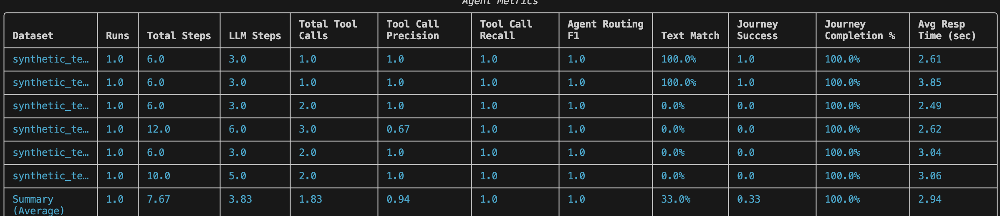

# Lab 2: Evaluation Framework - Automated Testing

## Lab Overview

**Duration:** 30 minutes
**Prerequisites:** Completed Lab 1, CLI installed, Python 3.8+

**Target Audience:** Developers, data scientists, and QA engineers who need programmatic access to detailed metrics, want to automate testing, and require deeper insights than the UI dashboard provides.

---

## Setup

### Step 1.1: Activate Environment

```bash
# If not already activated from Lab 1
orchestrate env activate <environment name>

# When prompted, enter:
# - API Key: [Your API key]
```

### Step 1.2: Create Directory Structure

```bash
mkdir -p evaluation/
```

### Step 1.3: Verify Agent Name

```bash
orchestrate agents list
```

### Configuration .env file 

```bash 
cp .env.example .env

#Edit your .env with your API Key and Service URL 
```
---

## Evaluation Framework

### How Evaluation Works

The evaluation framework uses a **surrogate user** (an LLM-powered agent) that simulates real user interactions:

```
                    ┌─────────────┐
                    │ User Story  │  (what the user wants to do)
                    └──────┬──────┘
                           │
                    ┌──────▼──────┐
                    │  Surrogate  │  (LLM simulates the user)
                    │    User     │
                    └──────┬──────┘
                           │ sends messages
                    ┌──────▼──────┐
                    │   Target    │  (your agent being tested)
                    │   Agent     │
                    └──────┬──────┘
                           │ responses
                    ┌──────▼──────┐
                    │  Compare    │  (actual vs expected)
                    │  Results    │
                    └─────────────┘
```

1. The surrogate user follows the **user story** to send messages to your agent
2. Your agent responds, calls tools, routes to collaborators
3. Actual tool calls and responses are **compared** against expected results
4. **Journey Success** = all tool calls correct + high-quality summary

### Scoring Metrics (evaluate)

| Metric | Description |
|---|---|
| **Tool Call Precision** | Correct tool calls / total tool calls |
| **Tool Call Recall** | Correctly sequenced tool calls |
| **Agent Routing Accuracy** | Correct collaborator routing |
| **Text Match** | 0-100% response similarity to expected |
| **Journey Success** | Boolean — entire flow correct end-to-end |
| **Avg Response Time** | Seconds per response |

---


#### validate-native .tsv testing 

1. TSV is converted to JSON test cases in `generated_test_data/`
2. A **surrogate user** (LLM) simulates each conversation with your agent
3. The surrogate user sends messages based on the user story
4. Your agent responds, calls tools, and completes the task
5. The final response is compared against the expected output

#### Example Output (IT Helpdesk)

```
[Task-0] 👤 User: I forgot my password and I need to reset it
[Task-0] 🤖 Agent: What is your employee ID?
[Task-0] 👤 User: It's EMP1234.
[Task-0] 🤖 Agent: → calls reset_password(employee_id="EMP1234")
[Task-0] 🤖 Agent: Your password has been reset. Temporary password: Temp@12342026!
[SUCCESS] Text message matched
```

**Key metrics to check**:
- **Text Match**: Does the response contain the expected output? (100% = all matched)
- **Journey Success**: Did the entire conversation flow complete correctly? (1.0 = yes)
- **Journey Completion %**: What percentage of the expected journey was completed?
- **Avg Resp Time**: Average response time per message (< 5 sec is good)

### quick-eval (Schema & Hallucination Check)

quick-eval checks a different angle than validate-native:

validate-native asked: “Is the final answer correct?” (text matching)
quick-eval asks: “Are the tool calls valid?” (schema compliance, no hallucinated tools)

|What It Checks |	Description |
|---|---|
|**Tool Calls** |	Total attempted invocations |
|**Successful Tool Calls** |	Error-free executions |
|**Schema Mismatch** |	Input/output schema incompatibilities |
|**Hallucination Failures** |	Calls to non-existent tools |


### CSV Evaluation:
CSV Evaluation offers inclusion of tools for generating test cases, generally leaning towards producing production-grade test case data. These generated test cases checks if the agent did call the right tool with the right parameters. Hence, the 2 key ingredients for generating the test cases would be User Stories and Tools. However, do take not that the agent has no role in generating these test cases! 
**How do we generate these test cases?**
User stories helps us to paint the picture in how the test case should emulate.
For our first ingredient, user_stories.csv is used to emulate the test cases. Within this CSV contains 2 column, consisting of story and agent. 

**user_stories.csv:**
```csv
story,agent
"I forgot my password. My employee ID is EMP1234.",it_helpdesk_agent
"Is Visual Studio Code in the Approved Software List under Software Installation Policy? I want to do software request for installation of Visual Studio Code on my machine. Employee ID EMP3456.",it_helpdesk_agent
"Is Photoshop in the Approved Software List under Software Installation Policy? I want to do software request for installation of Photoshop on my machine. Employee ID EMP3456.",it_helpdesk_agent
```
**Create this csv in /evaluation folder.** Story refers to how you would want the test case to be emulated while agent refers to the agent being involved in the emulation. When generating these user stories, one is recommended to be as concise and elaborate as possible as these user stories will be passed into a LLM. 

**request_software.py**
This is just another tool to request software just with a few additional steps to be part of the test case generation.
In this tool, you would notice that the comments in the tool is more verbose as compared to your default tool structure where you mostly explain your parameters, values and what the tool does. You can dictate how your tools outcome is being used by the agent. Lets take a look at the example below.

```
 When {is_approved} is False, always ensure that no ticket is created and redirect user to resolution as their next steps.
    Summarized output for this must be in this format when {is_approved} is False:
    "{software_name} is not in the Approved Software List. Your request for installation of {software_name} on your machine has been denied. {resolution}."
```

This extra verboseness allows the test case generator to understand what the final outcome would be when using this tool.

**Mock tool: company_combined_kb.py**
Another key thing to note, test case are generated based only based on what you have in your ADK environment and not within your orchestrate environment. 
Knowledge bases in orchestrate environment will not be used to generate test cases, hence if you want to run test cases where you prompt the knowledge base, you would have to create a mock tool to imitate the knowledge base tool. Pretty similar to creating test cases with Python MonkeyPatch where it stimulates call to the database without calling the database. 

In this lab, company_combined_kb.py would function as the mock tool. Do not upload this to orchestrate. Below is how the mock tool would look like.
```python
@tool
def company_combined_kb(query: str) -> str:
    """
    Read company_combined_kb knowledge base mainly on to check if software is in approved list. 
    Important: This is a mock tool to imitate internal orchestrate tool.
    Query must include "Return True or False only." at the end.
    Args:
        query: Query to company_combined_kb knowledge base. 
    Returns:
        True or False Only
    """
    if "Photoshop" in query:
        return "False"
    elif "Visual Studio Code" in query:
        return "True"
```

**Generating the test cases**
Now to the magical part, generating the test cases. Do run the code below and let it run. 
```bash
orchestrate evaluations generate \  
--stories-path ./evaluation/user_stories.csv \                        
--tools-path ./tools/ \
--output-dir ./evaluation/output
```
Now check **./evaluation/output** folder; new test cases are generated there.

**Checking Test Cases**
Since these test cases are created using LLM, quality check is still required to be made. Always ensure that your test cases are in the expected format. These test cases have a dependency graph built in how the test case flows as represented by **goals**. Lets take a look at the example below. 

```json
"goals": {
    "reset_password-1": [
      "summarize"
    ]
  }
```
To achieve the end goal, it has 2 actions consisting of 'reset_password-1' and 'summarize'. 'reset_password-1 refers to the name of the action. Since summarize is nested with 'reset_password-1', it would generally mean that the summarize should be called right after 'reset_password-1'.

Within each action, there are multiple parameters which are pretty self explanatory in what they do. 
```json
{
  "type": "tool_call",
  "name": "reset_password-1",
  "tool_name": "reset_password",
  "args": {
    "employee_id": "EMP1234"
  }
}
```
However for debugging purposes, do take note that there are different "type" value in actions available. Such value ranges from "tool call", "conversational_search" and "text". If the agent produces a result with 'type' different from the test case, the test case will ignore the result and log as a miss in **Journey Completion** despite achieving the same outcome.

A quick check before we move on to evaluating our test cases, ensure that your test cases are in these format below. For each actions in goals, ensure that there is **no dictionary type in args**. Also, for synthetic_test_case_2.json to synthetic_test_case_6.json, for each of the last action named 'summarize', change "type" value from 'text' to 'conversational_search'. Here's one example below.

```json
  {
    "type": "conversational_search",
    "name": "summarize",
    "response": "Photoshop is not in the Approved Software List. Your request for installation of Photoshop on your machine has been denied. Please inform your Manager and IT Security in person so they can personally raise the request for you.",
    "keywords": [
      "Photoshop",
      "denied",
      "Manager",
      "IT Security"
    ]
  }
```
**Configuring the Evaluator**
Before we perform evaluation, lets set up an evaluation configuration file under ./saas_evaluation_config. Below is the evaluator yaml config file example:

```yaml
test_paths:
  - {Your_test_path}
auth_config:
  url: {your orchsreate service url name}
  tenant_name: {your orchestrate env name}
output_dir: "test_case_result"
enable_verbose_logging: true
enable_fuzzy_matching: true  
is_strict: false 
llm_user_config:
  user_response_style:
  - "Be really concise in messages and confirmations."
n_runs: 2  # evaluations will run 2 times
```


**Evaluating Test Cases**
Run the command below.
```bash
orchestrate evaluations evaluate --config ./saas_evaluation_config/saas_evaluation_config.yaml --env-file .env
```

After running the command below, you should see something like this. 


**Understanding the testcase results**
For each test case results exists:
Test case has metrics, messages and message analysis.
Metrics refer to how the test case performs such as Tool call Precision, Recall and F1, along with Journey Success Percentage.
Messages refers to the user and agent communication history. You can look into this to look for error occuring within the test cases.
Message Analysis is an addition of metadata of the agent run, consist of "expected trajectory", "expected_tool_calls", "actual_tool_calls", "missed tool calls" and "text_match_candidates".

```json
{
  "meta": {
      "expected_trajectory": {
          "check_software_approval-1": [
              "request_software-1"
          ],
          "request_software-1": [
              "summarize"
          ]
      },
      "expected_tool_calls": [
          "company_combined_kb",
          "request_software"
      ],
      "actual_tool_calls": [
          "request_software",
          "company_combined_kb"
      ],
      "missed_tool_calls": [],
      "text_match_candidates": {}
  }
}
```

---

## Key Insights

### Optimization Opportunities 

**Agent Improvements:**
- Refine instructions
- Add examples
- Clarify tool usage

**Test Refinements:**
- Update expected keywords
- Adjust response templates
- Modify tool expectations

**Knowledge Base:**
- Add clearer headers
- Include more examples
- Improve policy wording


---

## Lab Comparison

| Aspect | Lab 1 | Lab 2 |
|--------|-------|-------|
| Method | Manual | Automated |
| Interface | Visual | CLI |
| Feedback | Real-time | Batch |
| Use Case | Debugging | Regression |
| Scalability | Limited | High |


---

## Troubleshooting

**Generate fails:**
```bash
orchestrate agents list  # Verify agent name
```

**Importing evaluation dependencies failed:**

``` bash
[ERROR] - Failed to import evaluation dependencies: No module named 'agentops'. Please install them using `pip install --upgrade "ibm-watsonx-orchestrate[agentops]"`

#USE THIS COMMAND:
pip install --upgrade "ibm-watsonx-orchestrate[agentops]"

#OR 

uv pip install --upgrade "ibm-watsonx-orchestrate[agentops]"
```
**Evaluation fails with 404:**
- Check model configuration in .env
- Verify matches agent's model

**All scores 0.0:**
- Verify agent has tools assigned
- Check knowledge base processed
- Test agent manually first

---
For Lab-2, if you have any queries, drop me an email darren.chew@ibm.com. :-D
Thank you! This is the END of AgentOps Lab. 
---


