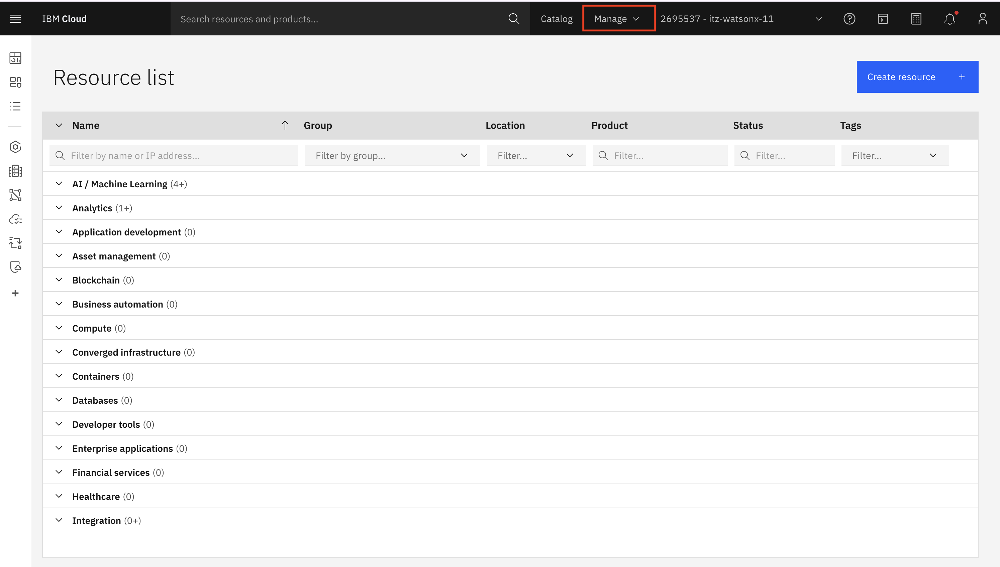
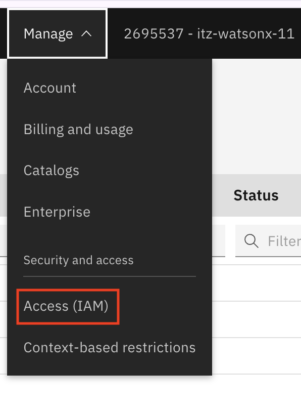
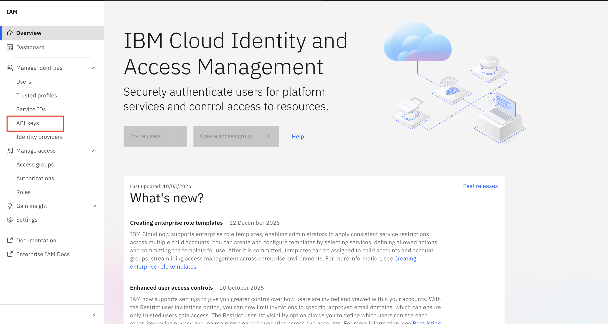
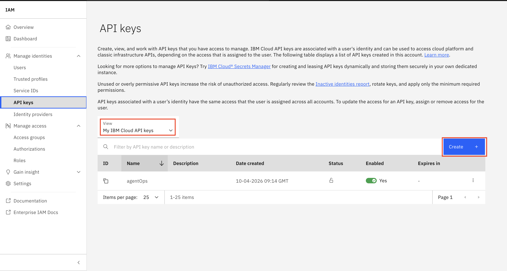
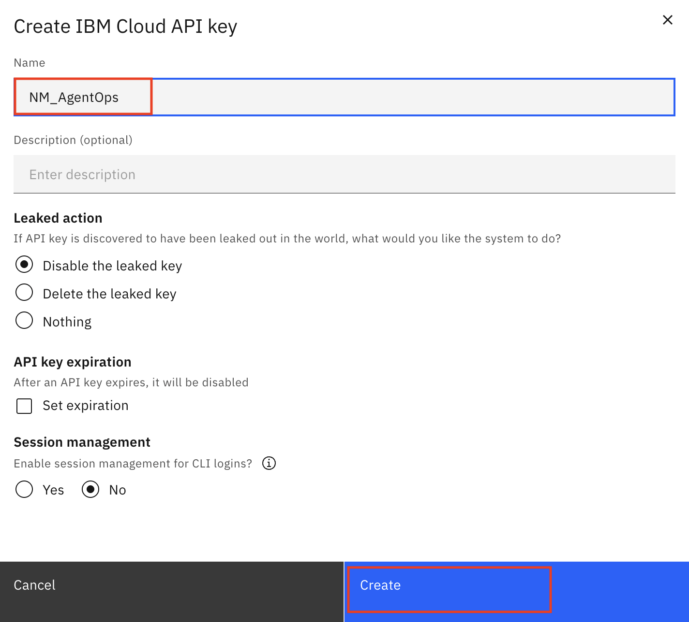
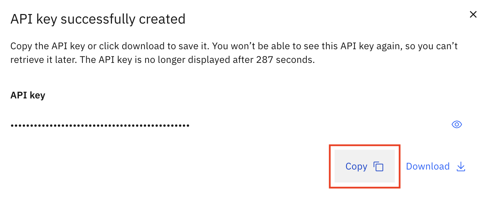
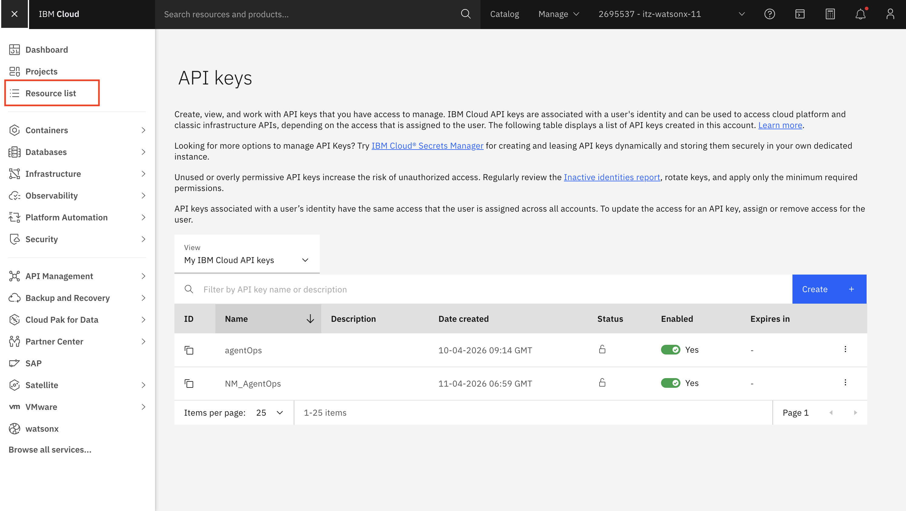
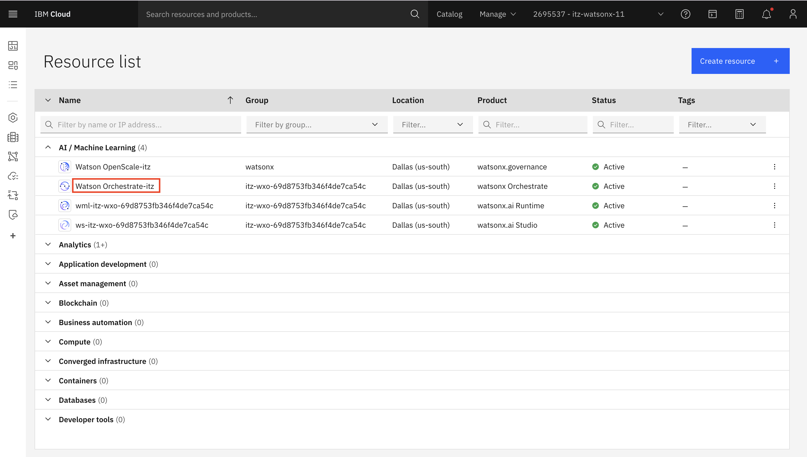
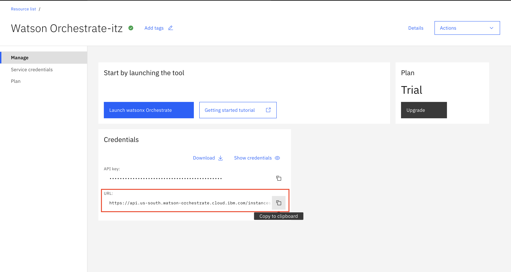

# IT HelpDesk Agent - Lab

## Overview

Complete hands-on lab package for learning agent monitoring and evaluation using Watson Orchestrate. Includes a IT Help Desk agent with IT support tools and company policy knowledge base.


## Lab Structure

### Lab 1: AgentOps UI Dashboard (30 minutes)

**Focus:** Visual monitoring and analysis

**What You'll Learn:**
- Navigate AgentOps dashboard
- Analyze Evaluation metrics (conversations, messages, tools)
- Perform deep Analysis (drill-down investigation)
- Identify cost drivers and performance issues
- Optimize agent behavior

**Key Sections:**
- **Evaluation:** High-level metrics and trends
- **Analysis:** Deep dive into conversations, messages, and tools


---

### Lab 2: Evaluation Framework (30 minutes)

**Focus:** Automated testing and programmatic evaluation

**What You'll Learn:**
- Create user stories for testing
- Define evaluation tools
- Generate synthetic test cases
- Run automated evaluations
- Analyze results programmatically

---

## Agent Configuration

### IT Help Desk 

**Purpose:** Help users with IT support, and policy related questions 

**Tools:**
- `escalate_ticket` - Create an escalation ticket for issues 
- `request_software` - Request software installations for approved software 
- `reset_password` - Reset the password for an employee and returns temporary password

**Knowledge Base:**
- `combined_kb` - Company IT policies and guidelines for employees

---

## Setup 

### Create the API Key and access the Service URL for your instance 

1. Access the IBM CLoud of your TechZone Instance 
2. To create your API Key, click on **Manage**

  

3. Click on **Access (IAM)**

  

4. Click on **API Key**

  

5. Ensure the View is selected as **My IBM Cloud API Keys** and Click on **Create**

  

6. Name your API Key and click on **Create**

  

7. **Important:** Copy the API Key to your notes to access easily during the lab 

  

8. Click on the Hamburger menu on the top left and select **Resource List**

  

9. Click on AI / Machine Learning and **Watson Orchestarte-itz**

  

10. Copy the Service URL to your notes to access easily during the lab

  

You are now ready to start the labs. Have fun!

## Lab Workflow

### Recommended Path

1. **Start with Lab 1** (30 min)
   - Import agent and tools
   - Add knowledge base
   - Generate test conversations
   - Explore AgentOps dashboard
   - Learn Evaluation and Analysis sections

2. **Then Complete Lab 2** (30 min)
   - Create user stories
   - Define evaluation tools
   - Generate test cases
   - Run automated evaluation
   - Analyze results programmatically

3. **Use Both Together**
   - Lab 1 for interactive debugging
   - Lab 2 for automated regression testing

---

## Troubleshooting

### Common Issues

**Issue: Import script fails**
```bash
# Solution: Check CLI installation
orchestrate --version
# Ensure environment is activated
orchestrate env activate `[Your_env_name]`
```

**Issue: Knowledge base not working**
```bash
# Solution: Verify document is processed
# In UI: Check document shows "Processed" status
# Wait 2-3 minutes after upload
```

**Issue: No data in dashboard**
```bash
# Solution: 
# 1. Verify monitoring is enabled
# 2. Wait 5-10 minutes for data
# 3. Refresh dashboard
```

**Issue: Evaluation fails**
```bash
# Solution: Check .env file
cat .env
# Verify agent name in helpdesk_validation.tsv
orchestrate agents list
```


## Additional Resources

### Documentation

- [Watson Orchestrate Docs](https://developer.watson-orchestrate.ibm.com)
- [AgentOps Dashboard](https://developer.watson-orchestrate.ibm.com/evaluate)
- [Evaluation Framework](https://developer.watson-orchestrate.ibm.com/evaluate/framework)
- [LLM Vulnerability Guide](https://developer.watson-orchestrate.ibm.com/evaluate/llm_vulnerability)


---

## Support

### Getting Help

**For Lab Questions:**
- Review lab guide thoroughly
- Check troubleshooting section
- Verify prerequisites

**For Technical Issues:**
- Check Watson Orchestrate status
- Verify credentials in .env
- Review error messages carefully

---

## Lab Comparison

| Aspect | Lab 1 | Lab 2 |
|--------|-------|-------|
| **Duration** | 30 min | 30 min |
| **Method** | Manual testing | Automated testing |
| **Interface** | Visual dashboard | Command line |
| **Focus** | Interactive exploration | Programmatic evaluation |
| **Best For** | Development & debugging | Regression testing |
| **Output** | Visual insights | Metrics & reports |

---

**Total Lab Time:** 1 hour
**Difficulty:** Beginner to Intermediate  
**Outcome:** Complete understanding of agent monitoring and evaluation

<!-- This is the base Jekyll theme. You can find out more info about customizing your Jekyll theme, as well as basic Jekyll usage documentation at [jekyllrb.com](https://jekyllrb.com/)

You can find the source code for Minima at GitHub:
[jekyll][jekyll-organization] /
[minima](https://github.com/jekyll/minima)

You can find the source code for Jekyll at GitHub:
[jekyll][jekyll-organization] /
[jekyll](https://github.com/jekyll/jekyll)


[jekyll-organization]: https://github.com/jekyll -->
